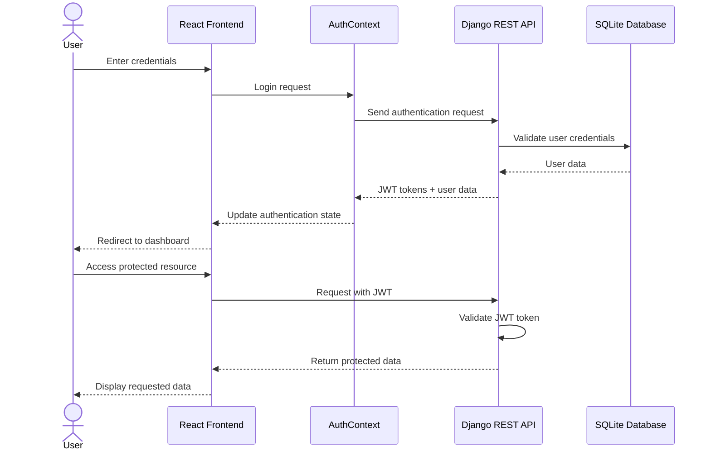
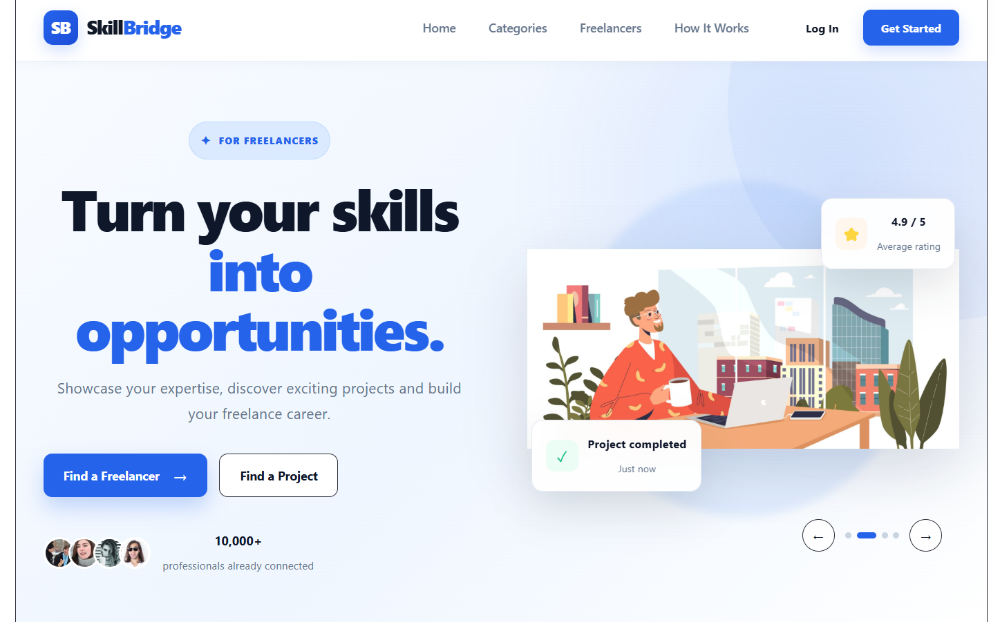
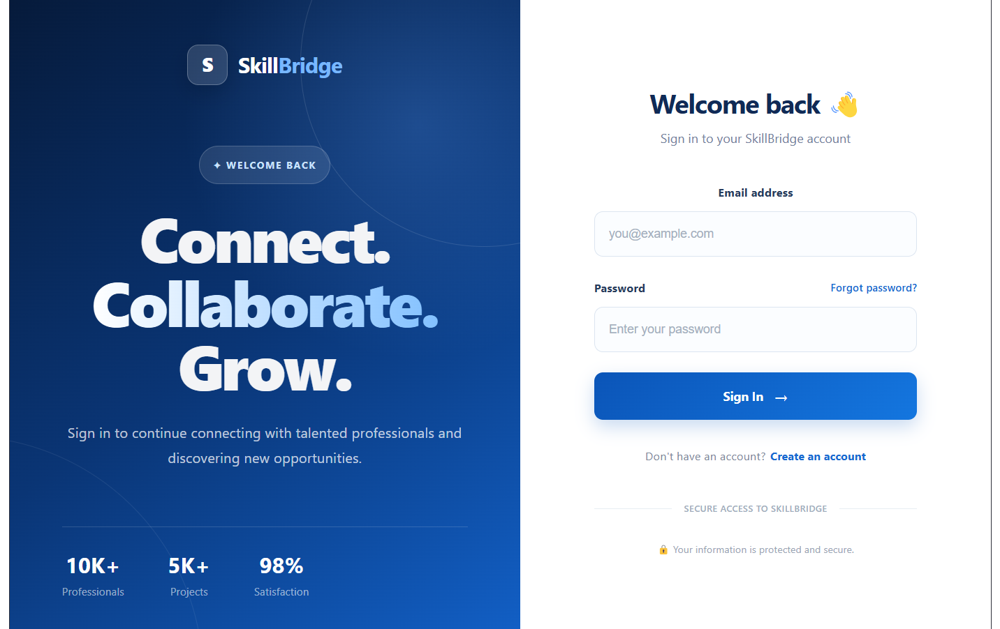
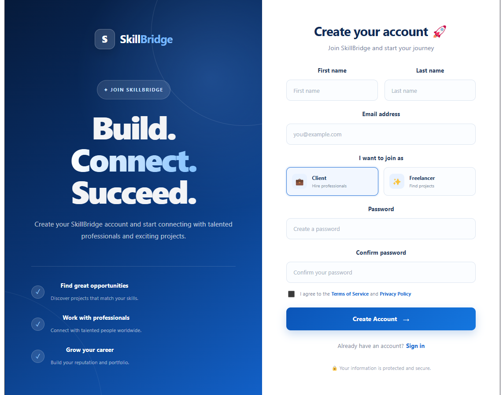

# 🌉 SkillBridge

> A modern full-stack freelance marketplace that connects clients with skilled freelancers through projects, profiles, and communication.

SkillBridge is a full-stack web application designed to simplify the connection between **clients looking for digital services** and **freelancers offering their skills**.

The platform provides dedicated experiences for clients and freelancers, including authentication, profile management, project management, communication, dashboards, and a responsive user interface.

---

## 📑 Table of Contents

* [🎯 About SkillBridge](#-about-skillbridge)
* [✨ Key Features](#-key-features)
* [👥 User Roles](#-user-roles)
* [🔄 How SkillBridge Works](#-how-skillbridge-works)
* [🏗️ System Architecture](#️-system-architecture)
* [🛠️ Technology Stack](#️-technology-stack)
* [📁 Project Structure](#-project-structure)
* [📸 Application Screenshots](#-application-screenshots)
* [⚙️ Installation & Setup](#️-installation--setup)
* [🔐 Environment Variables](#-environment-variables)
* [🧪 Testing](#-testing)
* [🔄 CI/CD](#-cicd)
* [🔌 API Overview](#-api-overview)
* [🛡️ Security](#️-security)
* [🗺️ Roadmap](#️-roadmap)
* [🤝 Contributing](#-contributing)
* [👩‍💻 Author](#-author)
* [📄 License](#-license)

---

## 🎯 About SkillBridge

SkillBridge is a freelance marketplace built around a simple goal:

> **Connect the right client with the right freelancer through a clear, structured, and user-friendly platform.**

The application separates the experiences of **clients** and **freelancers**, allowing each user type to access functionality adapted to their role.

### Main objectives

* Connect clients with skilled freelancers.
* Allow clients to create and manage projects.
* Allow freelancers to discover available opportunities.
* Provide dedicated dashboards for different user roles.
* Facilitate communication between users.
* Implement authentication and role-based access.
* Provide a clean and responsive user experience.
* Build a scalable foundation for future marketplace features.

---

## ✨ Key Features

### 🔐 Authentication

SkillBridge provides an authentication system that includes:

* User registration.
* User login.
* Authentication state management.
* Protected application areas.
* Client and freelancer roles.
* Backend-side authentication and permissions.

### 👤 Client Features

Clients can:

* Create an account.
* Log in securely.
* Manage their profile.
* Discover freelancers.
* Create projects.
* Manage their projects.
* Connect with freelancers.
* Communicate with freelancers.
* Access a dedicated client dashboard.

### 💼 Freelancer Features

Freelancers can:

* Create an account.
* Log in securely.
* Create and manage their professional profile.
* Showcase their skills.
* Discover available projects.
* Interact with clients.
* Manage their freelance activities.
* Access a dedicated freelancer dashboard.

### 📂 Project Management

The project marketplace provides functionality for:

* Creating projects.
* Viewing project information.
* Managing project-related information.
* Connecting clients and freelancers.
* Tracking project-related activities.

### 💬 Messaging

SkillBridge includes a dedicated messaging system that allows users to communicate with each other through the platform.

The messaging architecture is implemented through the Django backend and exposed to the React frontend through API services.

### 📊 Role-Based Dashboards

Each main user role has a dedicated dashboard:

```text
Client
   ↓
Client Dashboard
   ↓
Projects • Freelancers • Activities

Freelancer
   ↓
Freelancer Dashboard
   ↓
Projects • Skills • Activities
```

---

## 👥 User Roles

SkillBridge currently focuses on two main user roles.

| Role              | Main Responsibilities                                                           |
| ----------------- | ------------------------------------------------------------------------------- |
| 👤 **Client**     | Create projects, discover freelancers, manage activities and communicate        |
| 💼 **Freelancer** | Manage professional profile, showcase skills, discover projects and communicate |

This role-based structure allows the platform to provide different experiences depending on the user's needs.

---

## 🔄 How SkillBridge Works

```mermaid
flowchart TD
    START["🚀 SkillBridge"] --> HOME["🏠 Home Page"]

    HOME --> AUTH{"🔐 Authentication"}

    AUTH --> REGISTER["📝 Register"]
    AUTH --> LOGIN["🔑 Login"]

    REGISTER --> ROLE{"Choose Role"}
    LOGIN --> ROLE

    ROLE --> CLIENT["👤 Client"]
    ROLE --> FREELANCER["💼 Freelancer"]

    subgraph CLIENT_FLOW["👤 Client Journey"]
        CLIENT --> CLIENT_DASH["📊 Client Dashboard"]
        CLIENT_DASH --> CREATE["➕ Create Project"]
        CLIENT_DASH --> MANAGE["📁 Manage Projects"]
        CLIENT_DASH --> FIND["🔎 Find Freelancers"]
        CREATE --> PROJECT["📌 Project"]
        MANAGE --> PROJECT
        FIND --> COLLAB["🤝 Collaboration"]
    end

    subgraph FREELANCER_FLOW["💼 Freelancer Journey"]
        FREELANCER --> FREE_DASH["📊 Freelancer Dashboard"]
        FREE_DASH --> MARKET["📂 Marketplace"]
        FREE_DASH --> PROFILE["👤 Manage Profile"]
        MARKET --> BROWSE["🔎 Browse Projects"]
        BROWSE --> APPLY["📨 Apply / Collaborate"]
        APPLY --> COLLAB
        PROFILE --> COLLAB
    end

    PROJECT --> COLLAB
    COLLAB --> MESSAGES["💬 Messaging"]
    MESSAGES --> COMPLETION["✅ Project Completion"]

### 👤 Client Workflow

```text
Create an account
       ↓
Login
       ↓
Complete profile
       ↓
Discover freelancers
       ↓
Create a project
       ↓
Manage project activities
       ↓
Connect with freelancers
       ↓
Communicate
```

### 2. 🏗️ System Architecture

```markdown
## 🏗️ System Architecture

```mermaid
flowchart TB

    USER["👤 Client / Freelancer"]

    subgraph FRONTEND["⚛️ Frontend — React + TypeScript + Vite"]

        APP["App.tsx"]
        ROUTES["AppRoutes.tsx"]

        subgraph CONTEXT["Global Context"]
            AUTH["🔐 AuthContext"]
            THEME["🎨 ThemeContext"]
        end

        subgraph LAYOUTS["Layouts"]
            MAIN["MainLayout"]
            DASH["DashboardLayout"]
        end

        subgraph PAGES["Pages"]
            HOME["🏠 Home"]
            AUTH_PAGE["🔑 Auth"]
            CLIENT["👤 Client"]
            FREELANCER["💼 Freelancer"]
            MARKET["📂 Marketplace"]
            PROFILE["👤 Profile"]
            MESSAGES["💬 Messages"]
            ADMIN["⚙️ Admin"]
        end

        SERVICES["🔌 Services / API"]
    end

    subgraph BACKEND["🐍 Backend — Django + Django REST Framework"]

        CONFIG["⚙️ config"]

        ACCOUNTS["👥 accounts"]
        PROJECTS["📁 projects"]
        MESSAGES_APP["💬 messages"]
        MESSAGING["📨 messaging"]

        API["🌐 REST API"]
        AUTH_BACK["🔐 Authentication"]
    end

    DB[("🗄️ SQLite Database")]

    USER --> APP
    APP --> ROUTES

    ROUTES --> AUTH
    ROUTES --> THEME
    ROUTES --> MAIN
    ROUTES --> DASH

    MAIN --> HOME
    MAIN --> AUTH_PAGE

    DASH --> CLIENT
    DASH --> FREELANCER
    DASH --> MARKET
    DASH --> PROFILE
    DASH --> MESSAGES
    DASH --> ADMIN

    AUTH --> SERVICES
    PAGES --> SERVICES

    SERVICES -->|"HTTP / REST API"| API

    API --> CONFIG
    API --> ACCOUNTS
    API --> PROJECTS
    API --> MESSAGES_APP
    API --> MESSAGING
    API --> AUTH_BACK

    ACCOUNTS --> DB
    PROJECTS --> DB
    MESSAGES_APP --> DB
    MESSAGING --> DB

---
```
### 3. 🔐 Authentication Flow

```markdown
## 🔐 Authentication Flow


### Frontend responsibilities

The React frontend handles:

* User interface.
* Navigation and routing.
* Authentication state.
* API communication.
* Reusable components.
* Forms and interactions.
* Dashboards.
* Responsive presentation.

### Backend responsibilities

The Django backend handles:

* Business logic.
* Authentication.
* Authorization.
* Data validation.
* REST API endpoints.
* User management.
* Projects.
* Messaging.
* Database operations.

---

## 🛠️ Technology Stack

### Frontend

| Technology       | Purpose                       |
| ---------------- | ----------------------------- |
| **React**        | User interface                |
| **TypeScript**   | Type-safe development         |
| **Vite**         | Development and build tooling |
| **React Router** | Application routing           |
| **CSS**          | Interface styling             |

### Backend

| Technology                | Purpose                      |
| ------------------------- | ---------------------------- |
| **Python**                | Backend programming language |
| **Django**                | Web framework                |
| **Django REST Framework** | REST API development         |
| **PyJWT**                 | JWT authentication           |
| **django-cors-headers**   | Cross-origin requests        |
| **python-dotenv**         | Environment configuration    |

### Database

| Technology | Purpose                    |
| ---------- | -------------------------- |
| **SQLite** | Local development database |

### Testing & Quality

| Technology         | Purpose                           |
| ------------------ | --------------------------------- |
| **Django Tests**   | Backend testing                   |
| **Vitest**         | Frontend testing                  |
| **Playwright**     | End-to-end testing infrastructure |
| **GitHub Actions** | Continuous integration            |
| **Black**          | Python code formatting            |
| **isort**          | Python import organization        |

### Development Tools

* Git
* GitHub
* Visual Studio Code
* npm
* Python virtual environments

---

## 📁 Project Structure

```text
SkillBridge/
│
├── backend/
│   ├── accounts/
│   │   ├── migrations/
│   │   ├── management/
│   │   ├── authentication.py
│   │   ├── models.py
│   │   ├── serializers.py
│   │   ├── views.py
│   │   ├── urls.py
│   │   └── tests.py
│   │
│   ├── messages/
│   ├── messaging/
│   ├── projects/
│   ├── tests/
│   │
│   ├── config/
│   │   ├── settings.py
│   │   ├── urls.py
│   │   └── ...
│   │
│   ├── manage.py
│   └── requirements.txt
│
├── frontend/
│   ├── src/
│   │   ├── assets/
│   │   ├── components/
│   │   ├── context/
│   │   ├── data/
│   │   ├── hooks/
│   │   ├── layouts/
│   │   ├── pages/
│   │   ├── routes/
│   │   ├── services/
│   │   ├── styles/
│   │   ├── test/
│   │   └── types/
│   │
│   ├── e2e/
│   ├── package.json
│   ├── vite.config.ts
│   └── vitest.config.ts
│
├── screenshots/
│
├── .github/
│   └── workflows/
│       └── ci.yml
│
├── .gitignore
└── README.md
```

---

# 📸 Application Screenshots

## 🏠 Home Page

The SkillBridge landing page introduces the platform, explains its purpose, and provides access to the main functionalities.



---

## 🔐 Authentication

SkillBridge provides dedicated interfaces for both existing and new users.

### Login

The login interface allows users to securely access their SkillBridge account.



### Registration

The registration interface allows new users to create a SkillBridge account and select their platform role.



---

## 📊 Client Dashboard

The client dashboard provides access to client-specific activities, projects, and platform functionality.


---

## 💼 Freelancer Dashboard

The freelancer dashboard provides access to professional activities, projects, skills, and relevant platform functionality.


---

## 📂 Projects

The project area allows users to discover and interact with project-related information.

> Additional project screenshots can be added as the interface evolves.

---

## 💬 Messaging

The messaging system provides communication between clients and freelancers.

> Additional messaging screenshots can be added here when the final messaging interface is documented.

---

## ⚙️ Installation & Setup

### 📋 Prerequisites

Before running SkillBridge locally, make sure you have installed:

* **Python 3.13+**
* **Node.js**
* **npm**
* **Git**

Verify the installed versions:

```bash
python --version
node --version
npm --version
git --version
```

---

## 📥 Clone the Repository

```bash
git clone https://github.com/ChaimaHerkat/SkillBridge.git
cd SkillBridge
```

---

# 🔧 Backend Setup

Navigate to the backend:

```bash
cd backend
```

### 1. Create a virtual environment

#### Windows

```bash
python -m venv venv
```

Activate it:

```bash
venv\Scripts\activate
```

#### macOS / Linux

```bash
python3 -m venv venv
source venv/bin/activate
```

### 2. Install dependencies

```bash
pip install -r requirements.txt
```

### 3. Configure environment variables

Create a `.env` file inside:

```text
backend/
└── .env
```

Example:

```env
SECRET_KEY=your-secret-key
DEBUG=True
```

### 4. Apply migrations

```bash
python manage.py migrate
```

### 5. Start the backend

```bash
python manage.py runserver
```

The backend will normally be available at:

```text
http://127.0.0.1:8000/
```

---

# 💻 Frontend Setup

Open a second terminal.

From the project root:

```bash
cd frontend
```

Install dependencies:

```bash
npm install
```

Start the development server:

```bash
npm run dev
```

Vite will display the local development URL in the terminal, usually:

```text
http://localhost:5173/
```

---

# 🔐 Environment Variables

Sensitive configuration should be stored in environment variables rather than committed to Git.

Example:

```env
SECRET_KEY=your-secret-key
DEBUG=True
```

### Important

Never commit:

* Secret keys
* API keys
* Passwords
* Access tokens
* Production credentials

A `.env.example` file can be used as a safe template:

```env
SECRET_KEY=
DEBUG=True
```

---

# 🧪 Testing

SkillBridge includes testing infrastructure for both backend and frontend components.

## Backend Tests

From the `backend` directory:

```bash
python manage.py test
```

## Frontend Tests

From the `frontend` directory:

```bash
npm test
```

## Frontend Production Build

```bash
npm run build
```

## End-to-End Testing

The frontend also contains an `e2e/` structure for end-to-end testing with Playwright.

---

# 🔄 CI/CD

SkillBridge uses **GitHub Actions** to automate quality checks.

The workflow is located at:

```text
.github/workflows/ci.yml
```

The CI pipeline validates the project when changes are pushed or pull requests are created.

```text
             Push / Pull Request
                      │
                      ▼
              GitHub Actions
                      │
          ┌───────────┴───────────┐
          ▼                       ▼
   Backend Checks          Frontend Checks
          │                       │
          ▼                       ▼
   Tests / Quality         Tests / Build
          │                       │
          └───────────┬───────────┘
                      ▼
                   Status
```

This helps identify issues early and maintain project quality during development.

---

# 🔌 API Overview

The Django backend exposes REST API endpoints consumed by the React frontend.

The API is organized around the main application domains:

```text
API
│
├── Authentication
│   └── Accounts
│
├── Projects
│
└── Messaging
```

The frontend communicates with the backend through dedicated service/API modules, helping keep UI components separated from backend implementation details.

---

# 🛡️ Security

SkillBridge is designed with several security principles in mind:

* Backend-side authentication.
* JWT-based authentication.
* Server-side permission checks.
* Role-based access control.
* Environment-based configuration.
* CORS configuration for frontend/backend communication.
* Separation between frontend and backend responsibilities.

### Files that should remain outside version control

```text
.env
venv/
.venv/
__pycache__/
node_modules/
db.sqlite3
```

> Never commit real secrets, passwords, tokens, or production credentials to GitHub.

---

# 🗺️ Roadmap

SkillBridge currently provides the foundation of a freelance marketplace.

### ✅ Implemented Foundation

* [x] Project foundation
* [x] React + TypeScript frontend
* [x] Django backend
* [x] REST API architecture
* [x] Authentication foundation
* [x] Client/Freelancer roles
* [x] Role-specific dashboards
* [x] Project management foundation
* [x] Messaging architecture
* [x] Testing infrastructure
* [x] GitHub Actions / CI

### 🚧 Future Improvements

* [ ] Advanced project and freelancer search
* [ ] Reviews and ratings
* [ ] Real-time notifications
* [ ] Improved real-time messaging
* [ ] Online payment integration
* [ ] Advanced analytics dashboards
* [ ] PostgreSQL for production
* [ ] Cloud deployment
* [ ] Docker-based deployment
* [ ] Additional authentication providers
* [ ] Mobile application
* [ ] Advanced monitoring and logging

> The roadmap represents possible future improvements and does not necessarily mean these features are currently implemented.

---

# 🤝 Contributing

Contributions, suggestions, and improvements are welcome.

To contribute:

```bash
git clone https://github.com/ChaimaHerkat/SkillBridge.git
cd SkillBridge
```

Create a feature branch:

```bash
git checkout -b feature/your-feature
```

Make your changes, test them, and submit a pull request.

---

# 👩‍💻 Author

## Chaima Herkat

**Master 2 — Bioinformatics**

SkillBridge was developed as a full-stack software engineering project combining:

* Modern frontend development
* REST API development
* Authentication and authorization
* Database management
* Testing
* Continuous integration
* Version control

GitHub:
https://github.com/ChaimaHerkat

Email: 
chaimaherkat4@gmail.com

---

# 📄 License

This project is currently intended as an **educational and portfolio project**.

No specific open-source license has currently been defined for the repository.

---

# ⭐ Acknowledgements

Built with:

* [React](https://react.dev/)
* [TypeScript](https://www.typescriptlang.org/)
* [Vite](https://vite.dev/)
* [Django](https://www.djangoproject.com/)
* [Django REST Framework](https://www.django-rest-framework.org/)
* [GitHub Actions](https://github.com/features/actions)

---

<p align="center">
  Built with ❤️ by <strong>Chaima Herkat</strong>
</p>


